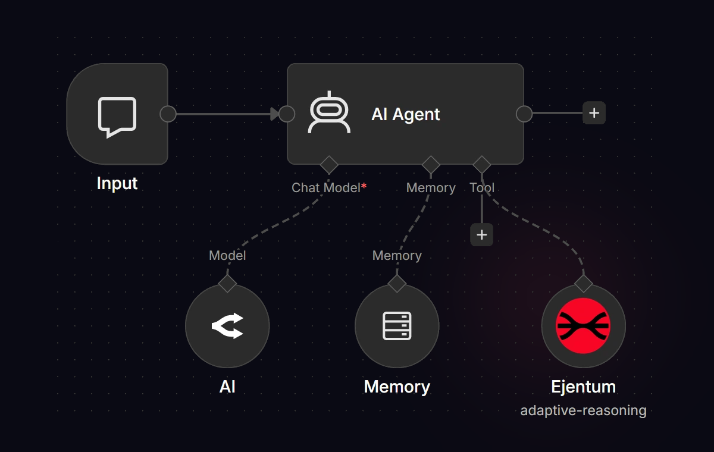

<div align="center">


<br/>
<sub>A tool your agent calls mid-loop, wired in next to its model and memory.</sub>

[](https://ejentum.com)
[](https://ejentum.com/docs)
[](https://github.com/ejentum/benchmarks)
[](https://github.com/ejentum/examples)
[](https://github.com/ejentum/benchmarks/blob/main/research/paper/under_pressure.pdf)
[](https://doi.org/10.5281/zenodo.19392715)
[](https://papers.ssrn.com/sol3/papers.cfm?abstract_id=6512038)
[](https://github.com/ejentum/builders_playbook)

</div>

---

Your agent is fluent. It's also confident when it shouldn't be, stops at the first plausible explanation, and fails silently inside a well-formed response. These failures don't throw exceptions. They ship to production.

**Ejentum exists because the reasoning gap is structural, not informational.** RAG solved what models know. Nobody solved how they think. We built for that.

**RA²R** (Reasoning Ability-Augmented Retrieval) retrieves engineered cognitive operations (not documents, not facts) and injects them into an LLM's context at inference time. 679 operations across four harnesses. One API call. The model's next output reflects a different reasoning structure before the first token generates.

---

## The Ejentum API

Your agent sends a task description. The Ejentum API returns a structured cognitive injection with six labeled blocks:

- **PROCEDURE:** the natural-language steps the model should follow
- **REASONING TOPOLOGY:** the same procedure as an executable DAG (Sn:steps, Gn{gates}, M{meta-nodes}, FREEFORM{exits})
- **COGNITIVE PAYLOAD:** named signals — `Amplify:` to activate, `Suppress:` to block, plus cognitive style and elasticity
- **FALSIFICATION TEST:** the verification criterion the model checks its output against
- **NEGATIVE GATE:** the failure pattern to avoid, stated as a concrete scenario the model recognizes
- **TARGET PATTERN:** what correct reasoning looks like

The injection is inserted into the agent's context window before the task. The suppression signals are the core mechanism. They constrain the model's output space multiplicatively: each named failure mode eliminates an entire branch of incorrect reasoning. In our testing, suppression consistently outperforms amplification alone.

Two delivery modes per harness:
- **Dynamic** — single retrieval. The highest-scoring operation comes back as-is. Predictable, fast.
- **Adaptive** — top-k retrieval, then an adapter LLM rewrites the operation with task-specific identifiers from your query. The procedure steps and topology nodes reference YOUR problem, not the canonical example.

```bash
curl -X POST "https://api.ejentum.com/harness/" \
  -H "Authorization: Bearer YOUR_KEY" \
  -H "Content-Type: application/json" \
  -d '{
    "query": "Our conversion rate dropped 40% after the checkout redesign. Determine whether the redesign caused the drop or if something else changed at the same time.",
    "mode": "reasoning"
  }'
```

### What comes back

```
[PROCEDURE]
Step 1: Identify the intervention, variable, or agent whose impact is being
attributed. Step 2: Simulate the counterfactual world where ONLY that element
is absent while all correlated variables are held at their natural values.
Step 3: Compute the difference between the factual and counterfactual outcome
distributions. Step 4: Check SUTVA (Stable Unit Treatment Value Assumption)
and flag violations where removal of the target variable changes the values
of the supposedly held-constant covariates. Step 5: Reject attribution claims
that do not survive the isolation test, where a proposed cause is actually a
proxy for a correlated variable that carries the true causal load.

[REASONING TOPOLOGY]
N{accept_attribution_based_correlation_alone} → FORK:
├→ S1a:simulate_factual(with_intervention) → ACTUAL[]
└→ S1b:simulate_counterfactual(without_intervention,hold_covariates) → CONTROL[]
→ JOIN → C{causal_impact = outcome(factual) - outcome(counterfactual)}
→ S2:apply_causal_impact → S3:check_SUTVA
→ G1{covariates_shift?} --yes→ FLAG:contaminated_isolation → OUT:invalid_attribution
                          --no→ G2{attribution_survives?}
                                --yes→ OUT:confirmed_impact
                                --no→ REJECT:proxy_for_correlated_var

[COGNITIVE PAYLOAD]
Amplify: potential outcomes simulation; counterfactual world construction; SUTVA enforcement
Suppress: correlation based attribution; shared variance credit diffusion
Cognitive Style: counterfactual reasoning
Elasticity: coherence=optimal isolation, expansion=adversarial perturbation

[FALSIFICATION TEST]
If the effect of a specific variable is estimated without verifying
controlling for correlated co-variables, impact isolation was not performed.

[NEGATIVE GATE]
The sales increase is attributed to the new marketing campaign, ignoring
correlated economic factors and treatment spillover.

[TARGET PATTERN]
Apply potential-outcomes simulation: construct the counterfactual world
where the intervention is absent, hold covariates at natural values,
and verify that the measured effect survives SUTVA checks before
accepting any causal claim.
```

The agent absorbs this before answering. Instead of accepting "the redesign caused the drop" on temporal proximity alone, it constructs a counterfactual world where the redesign did not happen, checks whether other variables (traffic source, device mix, pricing, market conditions) shifted in the same window, and either confirms the impact or rejects the attribution as a proxy for a correlated variable.

**Eight modes across four harnesses:**

| Mode | Harness | Delivery | Best for |
|------|---------|----------|----------|
| **reasoning** | Reasoning Harness | Dynamic | Single-domain reasoning, predictable injection cost |
| **adaptive-reasoning** | Reasoning Harness | Adaptive | Task-specific reasoning with named entities, variables, constraints |
| **code** | Code Harness | Dynamic | Code generation, refactoring, architecture |
| **adaptive-code** | Code Harness | Adaptive | Multi-file changes where the operation needs to reference specific symbols |
| **anti-deception** | Anti-Deception Harness | Dynamic | Sycophancy, hallucination, prompt injection prevention |
| **adaptive-anti-deception** | Anti-Deception Harness | Adaptive | Targeted attack-surface protection for a specific prompt or domain |
| **memory** | Memory Harness | Dynamic | State tracking, perception sharpening |
| **adaptive-memory** | Memory Harness | Adaptive | Multi-turn drift monitoring against named anchor concepts |

Retrieval under 1 second for dynamic, a few seconds for adaptive (one adapter-LLM round-trip). If the API is unreachable, your agent continues on native reasoning. Enhancement, not dependency.

---

## Why not just...

**Why not just write better prompts?**
Prompt engineering is O(n) work. Every new scenario needs a new prompt. Every model update risks breaking what worked. Ejentum selects from 679 cognitive operations across 4 harnesses at runtime. Zero prompt maintenance. One API call adapts to any task.

**Why not fine-tune?**
Fine-tuning burns reasoning into weights. It costs weeks, requires training data per domain, and must be repeated when the base model updates. The reasoning harness operates at the prompt level. No training, no data collection, no retraining cycle. Deploy in minutes, not months.

**Why not RAG?**
RAG retrieves information. Ejentum retrieves reasoning. Your agent already has the data. The problem is how it thinks about that data. RAG gives the agent more to read. Ejentum gives it a better way to think. Use both.

**Why not chain-of-thought?**
Chain-of-thought makes reasoning visible. Ejentum governs which reasoning steps to take and which failure modes to block. CoT says "show your work." Ejentum says "do this work, not that work." They are complementary. Use both.

**Why not just use a stronger model?**
We tested on Claude Opus 4.6 with maximum-effort extended thinking. The strongest reasoning model available. It scored 85.7% on hard competitive programming. Four tasks failed: two to reasoning spirals where the model thought for 600-1200 seconds and produced zero code. One API call per task fixed all four. The model had the knowledge. It lacked the convergence discipline. A stronger engine with uncalibrated steering still crashes.

---

## Four Product Layers

### Reasoning Harness: 311 operations, 6 cognitive dimensions

The original product. Addresses reasoning failures across extended execution chains. Each operation is a structured protocol with an execution topology, suppression vectors, amplification signals, and graph edges connecting it to other operations. Organized by class of cognitive failure, not by subject matter.

| Dimension | Operations | The failure it addresses |
|-----------|----------|--------------------------|
| **Causality** | 52 | Reverses the direction of causation. Treats correlation as mechanism. |
| **Temporal** | 51 | Compresses time. Confabulates timelines. Anchors to optimistic durations. |
| **Spatial** | 51 | Violates boundaries. Routes through walls. Ignores structural constraints. |
| **Simulation** | 52 | Can't hold a counterfactual. The real world bleeds into the hypothetical. |
| **Abstraction** | 51 | Collapses categories. Specifics absorb into generalities. Metaphor becomes mechanism. |
| **Metacognition** | 54 | Doesn't know it's wrong. Confidence is uniform. Errors reinforce errors. |

### Anti-Deception Harness: 139 operations, 6 protective domains

Blocks sycophancy, hallucination, social engineering, and prompt injection. Tested cross-model on GPT-4o.

- **ELEPHANT sycophancy benchmark:** 5.8% composite sycophancy across 40 real Reddit scenarios
- **Adversarial social engineering:** Detected at Turn 6 in a 20-turn adaptive attack. 27/30 blind evaluation
- **Hallucination prevention:** Zero hallucinations across 5 fabrication tests

### Code Harness: 128 operations, 13 engineering disciplines

Engineering operations for code generation, refactoring, security auditing, and architecture. Tested on competitive programming and scientific computing.

- **LiveCodeBench Hard:** 85.7% to 100% on 28 hard AtCoder tasks. Zero regressions
- **SciCode:** Zero bugs on 10 hard scientific computing problems with dual injection (reasoning + code stacked)

### Memory Harness: 101 operations, 6 perceptual domains

Perception sharpening and behavioral calibration. The model detects what changed, not just what was said. Two-pass protocol: observe first (free perception), then sharpen (focused injection).

- **State tracking:** 50% fewer stale facts served as current across 20-turn conversations
- **Perceptual detection:** 3x signal detection rate in coaching conversations
- **Blind evaluation:** 4.1/5 vs 3.5/5. The evaluator independently named the core insight: *"Retention without updating is a liability"*

Browse all 679 operations: [ejentum.com/abilities](https://ejentum.com/abilities)

---

## Measured Results

**Headline numbers (external, binary, reproducible):**
- **LiveCodeBench Hard: 85.7% → 100%** on 28 hard AtCoder tasks. Zero regressions across three batches.
- **SciCode: 7 → 0 correctness bugs** on 10 hard scientific computing problems. Blind evaluator chose injection on 10/10.
- **ELEPHANT sycophancy: 5.8% composite** across 40 real Reddit scenarios. Cross-model validated on GPT-4o.
- **Memory state tracking: 50% fewer stale facts** served as current across 20-turn conversations. Blind eval 4.1/5 vs 3.5/5.

Eight benchmarks across four harnesses. Two-stage blind protocol on reasoning and memory. Exact-match on code. Cross-model validation on anti-deception and memory (GPT-4o). Source data for every number is in the [benchmarks repo](https://github.com/ejentum/benchmarks).

### Code Harness (external, binary correctness)

**LiveCodeBench Hard: 28 hard competitive programming tasks.** Designed by an independent research team.

| Condition | Passed | Rate |
|-----------|--------|------|
| Baseline (Opus max effort) | 24/28 | 85.7% |
| **With Ejentum injection** | **28/28** | **100.0%** |

**+14.3pp. Four tasks gained. Zero lost. Zero regressions across three independent batches.**

**SciCode: 10 hard scientific computing problems.** Externally published benchmark. Dual injection (reasoning + code modes stacked).

| Condition | Correctness Bugs | Blind Evaluation |
|-----------|-----------------|-----------------|
| Baseline (Opus 4.6) | 7 bugs | (not scored) |
| **With dual injection** | **0 bugs** | **10/10 chose injection** |

### Anti-Deception Harness (cross-model on GPT-4o)

**ELEPHANT: 40 real Reddit sycophancy scenarios.** Externally published benchmark. Cross-model validation: these results are on GPT-4o, not Claude.

| Metric | With Injection |
|--------|---------------|
| Composite sycophancy | **5.8%** |
| Framing sycophancy | **7.5%** |
| Social engineering detection (20-turn adaptive) | **Turn 6 of 20** |
| Hallucinations (5 fabrication tests) | **0** |

### Reasoning Harness

**BBH / CausalBench / MuSR: 70 published academic tasks.** Externally designed by independent research teams.

| Factor | Baseline | With Injection | Change |
|--------|----------|---------------|--------|
| Composite | 0.476 | 0.684 | **+20.8pp** |
| Self-Monitoring | 0.74/3.0 | 1.73/3.0 | **+134%** |
| Correctness | 2.19/3.0 | 2.33/3.0 | **+6%** |

**EjBench: 180 custom professional tasks.** Designed by Ejentum as a harder stress test after external validation. Same blind protocol as BBH above. Reported here for transparency despite custom design.

| Factor | Baseline | With Injection | Change |
|--------|----------|---------------|--------|
| Composite | 0.621 | 0.722 | **+10.1pp** |
| Self-Monitoring | 0.94/3.0 | 1.81/3.0 | **+92%** |
| Verification | 1.50/3.0 | 2.16/3.0 | **+45%** |

### Memory Harness (cross-model on GPT-4o)

**20-turn Vantage scenario: implicit state changes.** Conversation designed to silently walk back Turn-1 facts by Turn 19. Measures whether the agent detects the shifts or serves stale facts.

| Metric | Baseline | With Injection | Change |
|--------|----------|---------------|--------|
| Stale facts served as current | 1.6 | 0.8 | **-50%** |
| Perceptual detection rate (Morgan 15-turn) | 14% | 43% | **3x** |
| Blind evaluation (5-point) | 3.5 | **4.1** | +17% |

### Research process evidence: ARC-AGI-3

**25 interactive reasoning steps.** Neither condition cleared Level 0 (baseline rate on ARC-AGI-3 is <1% across all frontier models). This is not a headline result; it is evidence that the injection persists and compounds over extended execution, not a claim of task completion.

| Metric | Baseline | Augmented |
|--------|----------|-----------|
| Memory decay slope | -0.005 (degrading) | +0.014 (improving) |
| Injection half-life | 0 | 24 steps (entire game) |
| Reasoning depth trend | 0.86 | 10.50 (12.2x) |

Full reports, raw traces, generation outputs, judgment scores: **[ejentum/benchmarks](https://github.com/ejentum/benchmarks)**

---

## Built by one person

Ejentum is built by Frank Brsrk (Franko Luci). Self-taught AI developer. Solo founder. One person engineering the operations, running the benchmarks, shipping the system.

When results disappoint, they're published alongside the improvements. When the most complex mode underperformed the simplest one, it was deprecated and documented. When 62% of tasks received the wrong reasoning domain and improvements persisted anyway, that was published too, because the finding was more valuable than the embarrassment.

Based in Athens, Greece. Contact: [info@ejentum.com](mailto:info@ejentum.com).

---

## Integrate

One REST endpoint, or a native package for your stack. Each shim exposes 8 tools (4 harnesses × dynamic + adaptive).

| Surface | Install | Notes |
|---|---|---|
| **MCP Server** (Cursor, Claude Code, Windsurf, Continue, Cline, n8n MCP node) | `npx -y ejentum-mcp` | Listed on Smithery, Glama, mcp.so, PulseMCP, Cline Marketplace, Continue Hub, Docker MCP Registry, mcpservers.org, and the official MCP Registry |
| **Anthropic Claude Code plugin directory** | Install from the directory UI | Published 2026-05-22 |
| **n8n community node** | `npm install n8n-nodes-ejentum` | 8 operations as a native n8n node, `usableAsTool` for the n8n AI Agent |
| **CrewAI** | `pip install crewai-ejentum` | `EjentumHarnessTool` with `mode` arg |
| **Agno** | `pip install agno-ejentum` | `EjentumTools` Toolkit with 8 methods |
| **PydanticAI** | `pip install pydantic-ai-ejentum` | `EjentumToolset(FunctionToolset)` with closure-based config |
| **HuggingFace smolagents** | `pip install smolagents-ejentum` | 8 `Tool` subclasses + `ejentum_tools()` factory |
| **LangChain** | `pip install langchain-ejentum` | 8 `BaseTool` subclasses + `EjentumTools` factory |
| **Letta** | `pip install letta-ejentum` | 8 plain functions serialised for Letta's sandbox |
| **Microsoft AutoGen** | `pip install autogen-ejentum` | 8 async closures (httpx + respx tested) |
| **Vercel AI SDK** | `npm install ejentum-ai` | Tool object factory for the AI SDK loop |
| **Mastra** | `npm install ejentum-mastra` | Mastra tool definitions |
| **LangGraph.js** | `npm install ejentum-langgraph` | Node factory for LangGraph graphs |
| **Firebase Genkit** | `npm install ejentum-genkit` | `defineTool` registrations |
| **OpenAI Agents SDK** (function tool) | [`openai_agents_tool.py`](https://github.com/ejentum/examples/blob/main/python/openai_agents_tool.py) | Single function tool for the Responses API |
| **OpenAI Agents SDK** (MCP transport) | [`openai_agents_streamable_http.py`](https://github.com/ejentum/examples/blob/main/python/openai_agents_streamable_http.py) | Streamable-HTTP MCP transport variant |
| **Anthropic Claude SDK** | [`claude_agent_sdk.py`](https://github.com/ejentum/examples/blob/main/python/claude_agent_sdk.py) | `tool_use` definition for Claude agents |
| **Zed editor** | Install **Ejentum** from Zed Extensions | Rust + Wasm extension wrapping ejentum-mcp |
| **Python** (custom integration) | [`basic.py`](https://github.com/ejentum/examples/blob/main/python/basic.py) | Minimal POST + inject |
| **TypeScript** (custom integration) | [`basic.ts`](https://github.com/ejentum/examples/blob/main/typescript/basic.ts) | Minimal fetch + inject |
| **Skill Files** (Cursor, Windsurf, Claude Code, Codex) | [skill files](https://github.com/ejentum/examples/tree/main/skill-files) | Drop in `~/.claude/skills/` |
| **n8n workflow JSON** | [`ejentum_workflow.json`](https://github.com/ejentum/examples/blob/main/n8n/ejentum_workflow.json) | Importable visual workflow |
| **curl** | [`single.sh`](https://github.com/ejentum/examples/blob/main/curl/single.sh) | Raw HTTP one-liner |

All examples: **[ejentum/examples](https://github.com/ejentum/examples)**

---

## Production Considerations

Ejentum is designed as a non-critical enhancement layer. The Ejentum API sits outside your agent's critical path: if it's unreachable, your agent continues on native reasoning.

- **Graceful degradation is first-class.** On timeout, 5xx, or rate limit, your agent continues on native reasoning. The API never blocks agent execution. See [graceful_degradation.py](https://github.com/ejentum/examples/blob/main/python/graceful_degradation.py) for the production pattern.
- **Recommended timeout:** 5 seconds for dynamic modes, 15 seconds for adaptive modes (adapter LLM adds a round-trip).
- **Rate limit:** 100 requests/minute across all tiers.
- **Cost impact:** injection adds ~400–900 tokens to each augmented LLM call. This adds cost to your LLM bill; size depends on your model provider's rates.
- **Data handling:** task descriptions sent via the `query` parameter are processed for operation retrieval only. EU hosting. Contact [info@ejentum.com](mailto:info@ejentum.com) for data processing questions.

---

## Pricing

| | Free trial | Go | Super |
|---|---|---|---|
| **Price** | Free (30 days) | €5/month | €25/month |
| **Dynamic calls** | 1,000 (trial total) | 1,000/month | 5,000/month |
| **Adaptive calls** | — | 250/month | 1,500/month |
| **Modes** | Dynamic reasoning only | All 8 modes | All 8 modes |
| **Rate** | 100/min | 100/min | 100/min |

No card required for the 30-day trial. [Get your API key](https://ejentum.com/dashboard) · [Full pricing](https://ejentum.com/pricing).

---

## Unexpected Findings

We built injections to prevent reasoning shortcuts. We did not build them to teach new reasoning modalities. But during testing, behaviors emerged that we did not engineer:

**Spontaneous domain shift.** At step 15 of a 25-step ARC-AGI-3 spatial navigation game, the augmented agent stopped reasoning in natural language and switched to symbolic mathematical notation. It defined formal variables, computed coordinates algebraically, and reasoned about movement vectors. The suppression signal (`start_end_only_thinking`) constrained a failure mode. The agent found its own solution to that constraint. The suppression was the pressure. The math was the agent's adaptation.

**Emergent query evolution.** The agent's queries to Ejentum improved systematically over 25 steps, from generic ("help me reason about this game") to spatially precise ("wall barrier at x=29-33 for rows 30-39 blocks rightward movement") to metacognitive ("robot appears stuck after 5 turns"). Nobody instructed query format or specificity. The agent learned to be a better user of the reasoning harness through practice, not instruction.

**The tense test.** In Memory Harness testing, a fact established in Turn 1 was implicitly walked back by Turn 19 without explicit correction. The baseline agent's scratchpad still said "Rust is their competitive advantage" (present tense). The augmented agent's said "Rust was initially considered their competitive advantage" (past tense). One word. The difference between accurate memory and stale memory.

These are observations from traced data, not marketing claims. Full step-by-step traces are in the [benchmarks repo](https://github.com/ejentum/benchmarks). We report them because they suggest something about how suppression signals interact with model behavior that we don't fully understand yet.

---

## What We Know, What We Don't

**What the data demonstrates:**
- Structured cognitive injection produces measurable behavioral changes across eight independent benchmarks, multiple model sizes, and single-turn, multi-step, code generation, anti-deception, and memory settings.
- Suppression signals work even when the retrieved operation comes from a mismatched domain (retrieval precision was 38%; improvements persisted).
- Injections persist across extended execution chains (half-life: 24 steps) and compound rather than degrade.
- On competitive programming, the injection improved correctness from 85.7% to 100% with zero regressions.
- On scientific computing, dual injection (reasoning + code stacked) eliminated all 7 correctness bugs.
- On sycophancy, the injection reduced composite sycophancy to 5.8% across 40 real scenarios, validated cross-model on GPT-4o.
- On memory, the injection halved stale facts served as current, confirmed by blind evaluator.

**What we haven't proven:**
- **Full cross-model generalization.** Anti-deception is validated on GPT-4o. Reasoning and code benchmarks are Claude-only. Multi-model testing is in progress.
- **Ablation of suppression vs. amplification.** We observe that suppression consistently outperforms amplification. We have not published a controlled ablation isolating the two mechanisms.
- **Human evaluation at scale.** Our evaluations use a two-stage blind protocol with LLM-as-judge. Human evaluation on a subset would strengthen the evidence.

We publish limitations because the work should be evaluated on what it demonstrates, not what we believe it will demonstrate. Every claim traces to a data file. The [benchmarks repo](https://github.com/ejentum/benchmarks) contains the raw data so you can verify independently.

---

## Repositories

| Repo | What's inside |
|------|--------------|
| **[ejentum-mcp](https://github.com/ejentum/ejentum-mcp)** | MCP server exposing 8 cognitive operations (4 harnesses × dynamic + adaptive) as MCP tools. One-click install via [Smithery](https://smithery.ai/servers/ejentum/ejentum-mcp), [Glama](https://glama.ai/mcp/servers/ejentum/ejentum-mcp), or [mcp.so](https://mcp.so/server/ejentum-mcp/Ejentum). MIT. |
| **[agent-teams](https://github.com/ejentum/agent-teams)** | Multi-agent teams (orchestrator + specialists, each with a mode-specific harness). Adversarial code review and eval workflows shipped. MIT. |
| **[eval](https://github.com/ejentum/eval)** | Open-source eval workflows (n8n + Python) for A/B testing tools, harnesses, prompts. Blind judges, fairness guarantees, sample results. MIT. |
| **[benchmarks](https://github.com/ejentum/benchmarks)** | Full reports, raw traces, generation outputs, judgment scores, system prompts. Eight benchmark suites. CC BY 4.0. |
| **[docs](https://github.com/ejentum/docs)** | Documentation pages. Quickstart to advanced method. Same content as [ejentum.com/docs](https://ejentum.com/docs). |
| **[examples](https://github.com/ejentum/examples)** | Integration examples. Python, TypeScript, curl, skill files, n8n workflow, no-code guides. MIT. |
| **[builders_playbook](https://github.com/ejentum/builders_playbook)** | 28 screenshots from real work sessions. Field notes from inside the IDE. |


### Framework Packages

Standalone packages on PyPI and npm, one per host framework. Each speaks the host framework's native idiom rather than mirroring the previous shim. Each ships 8 tools (4 harnesses × dynamic + adaptive).

| Package | Registry | Repo |
|---|---|---|
| `crewai-ejentum` | PyPI | [crewai-ejentum](https://github.com/ejentum/crewai-ejentum) |
| `agno-ejentum` | PyPI | [agno-ejentum](https://github.com/ejentum/agno-ejentum) |
| `pydantic-ai-ejentum` | PyPI | [pydantic-ai-ejentum](https://github.com/ejentum/pydantic-ai-ejentum) |
| `smolagents-ejentum` | PyPI | [smolagents-ejentum](https://github.com/ejentum/smolagents-ejentum) |
| `langchain-ejentum` | PyPI | [langchain-ejentum](https://github.com/ejentum/langchain-ejentum) |
| `letta-ejentum` | PyPI | [letta-ejentum](https://github.com/ejentum/letta-ejentum) |
| `autogen-ejentum` | PyPI | [autogen-ejentum](https://github.com/ejentum/autogen-ejentum) |
| `llama-index-tools-ejentum` | GitHub (PyPI registration pending) | [llama-index-tools-ejentum](https://github.com/ejentum/llama-index-tools-ejentum) |
| `ejentum-ai` | npm | [ejentum-ai](https://github.com/ejentum/ejentum-ai) |
| `ejentum-mastra` | npm | [ejentum-mastra](https://github.com/ejentum/ejentum-mastra) |
| `ejentum-langgraph` | npm | [ejentum-langgraph](https://github.com/ejentum/ejentum-langgraph) |
| `ejentum-genkit` | npm | [ejentum-genkit](https://github.com/ejentum/ejentum-genkit) |
| `n8n-nodes-ejentum` | npm | [n8n-nodes-ejentum](https://github.com/ejentum/n8n-nodes-ejentum) |

Plus the [`integrations`](https://github.com/ejentum/integrations) repo (n8n workflows + editor skill files) and [`zed-ejentum-mcp`](https://github.com/ejentum/zed-ejentum-mcp) (Zed extension).

---

<div align="center">

**Ejentum.** Reasoning Harness for Agentic AI.

Where RAG retrieves what the model should know, RA²R retrieves how it should think.

[ejentum.com](https://ejentum.com) · [documentation](https://ejentum.com/docs) · [blog](https://ejentum.com/blog) · [info@ejentum.com](mailto:info@ejentum.com)

</div>
